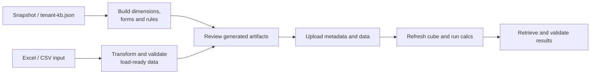

# EPM Planning Forge

Toolkit to accelerate an Oracle EPM Planning delivery from build through validation:

- create dimensions, forms, and calculation-rule artifacts;
- transform controlled Excel/CSV inputs into Planning-ready load files;
- upload data and metadata;
- run calculations and aggregations;
- retrieve results and validate the completed delivery.

The goal is a repeatable, reviewable workflow instead of rebuilding every Planning
implementation manually. Generation happens locally first; pod mutations remain
explicit operations.

> **Generation is offline.** EPM Automate is required only for the automated metadata
> upload/import command (`importmetadata` / `refreshcube`). Generated form LCM packages
> can be uploaded manually through **Tools → Migration**. Install EPM Automate from the
> pod's **Downloads** page when using automated deployment (Windows default:
> `C:\Program Files\Oracle\EPM Automate`; override with `EPM_AUTOMATE`).

This is the **builder** counterpart to
[`packages/mcp-planning`](../mcp-planning):

| | epm-planning-mcp | **epm-planning-forge** |
| --- | --- | --- |
| Explore the environment | ✅ | ✅ (reads the same snapshot) |
| Query / load data, run rules | ✅ | Roadmap orchestration |
| Create dimensions | ✗ (out of scope) | ✅ |
| Create forms | ✗ (out of scope) | ✅ LCM generator |
| Create calc rules | ✗ (out of scope) | Template today; generator planned |

## Install

```bash
git clone https://github.com/BryantParkConsulting/oracle-toolkit.git
cd oracle-toolkit/packages/forge
npm install
```

Then, one time:

1. **Install EPM Automate** from your pod's Downloads page if you want automated
   metadata upload/import.
2. **Reuse your pod profile.** If you already set up
   [`packages/mcp-planning`](../mcp-planning), the forge
   reads the same `~/.epm/clients.json` + `.epw` — nothing else to do. If not, run that
   project's `npm run setup` once to create it.
3. **Create an Import Metadata job** in the pod (Application → Overview → Jobs), mapped to
   the dimension you'll load. You pass its name with `--job`.

That's it — you author CSVs and generate/upload from the command line (see below).

## Delivery workflow



Nothing reaches the pod during generation. Upload/import is always a separate,
deliberate action; the existing automated metadata command requires `--yes`.

## What's here today

### Dimensions — solid

Author a friendly CSV:

```
member,parent,alias,storage,aggregation
DEPT_900,Total Department,New Region,store,+
DEPT_901,DEPT_900,West,store,+
```

Generate the Planning import format and upload:

```bash
node bin/make-dimension.mjs Department my-members.csv --out Department-import.csv
node bin/import.mjs <client> Department-import.csv --job <ImportMetadataJob>   # add --yes to run
```

The generated CSV is exactly what Import Metadata / Outline Load consumes — the same
format an LCM export produces. This path is proven.

### Forms — LCM generator

Create one or more forms from a JSON specification and package them as a Migration
snapshot:

```bash
node bin/make-forms.mjs examples/forms.example.json \
  --out planning-forms-lcm.zip \
  --dir dist/forms-review
```

The ZIP includes all three layers Oracle Migration needs:

- each Data Form XML;
- application manifests and `artifactListing`;
- root `Import.xml`, `Export.xml`, and `size.txt`.

Upload the ZIP in **Tools → Migration → Snapshots**, expand the Planning application,
select the forms, and run Import. The optional `memberCatalog` validates exact member
names before generation, catching aliases such as `No_Department` when the real member
is `No Department`.

The package shape has been verified with a successful Planning Migration import.
Always use the `ExportedVersion` from a recent snapshot of the target pod to avoid a
version-compatibility warning.

### Cell-level security — LCM generator

Restrict one cube to the people who own it, without touching the rest of the
application:

```bash
node bin/make-security.mjs examples/cell-security.example.json \
  --out security-lcm.zip \
  --carry-over "<snapshot>/HP-<App>/resource/Security/Cell-Level Security Definitions"
```

`--carry-over` ships the rules already live in the target app, verbatim, next to the
new ones — Oracle does not document whether this import merges or replaces, and
carrying them makes the question moot. The manifests name only
`/Security/Cell-Level Security Definitions`, so an import can never disturb
`/Security/Access Permissions`.

Three things about Planning security worth knowing before generating anything:

- **Cell-level security only denies.** There is no "grant to X" — you deny a group
  that X is not in. Deny always wins, so never assign a rule to the role groups
  (`Power User`, `User`, `Viewer`): the person you meant to protect holds one too.
- **Member ("account") permissions are not cube-aware**, and do nothing until
  *Apply Security* is enabled for the dimension — which puts every member of that
  dimension under permissions that usually do not exist yet. To restrict a single
  cube, this is the tool.
- **A Service Administrator is exempt** from both. Restricting an administrator
  means moving them off that role in Access Control. Group membership lives there
  too and never travels in the package.

### Calc rules — templated, generator planned

`templates/` holds Calculation Manager XML captured from a live tenant as a grounded
starting point. A rule generator and rule deployment workflow are planned.
Always import into a **test** application first and diff the result before touching
production.

### Data loads, calculations, and delivery validation — roadmap

The intended end-to-end Forge workflow also covers:

1. mapping an Excel/CSV input workbook to exact Planning member names;
2. generating and submitting the data load;
3. executing clear, calculate, and aggregate rules in a controlled sequence;
4. retrieving review grids;
5. reconciling the result to the source workbook.

These orchestration commands are not implemented yet. Today, dimension generation is
proven, form LCM generation is implemented, and metadata upload is available through
EPM Automate. The roadmap above is the next functional layer—not a claim that the
current CLI already performs every step.

## Prerequisites

- Node 18+
- **EPM Automate** installed only when using automated metadata upload/import.
- A `~/.epm/clients.json` profile + `.epw` — reuse the one the `epm-planning-mcp`
  setup wizard creates.
- An **Import Metadata job** defined once in the pod (Application → Overview → Jobs),
  mapped to the dimension you're loading. Pass its name with `--job`.

## Safety

- Generation writes only local files. Review them before any upload.
- The import step requires `--yes` and prints what it will do first.
- Restore-snapshot is never implemented.
- Client CSVs, XML and profiles are gitignored — public examples must be synthetic.

## License

MIT. Oracle, NetSuite, Essbase and related marks belong to their owners. Independent,
not endorsed by Oracle.
