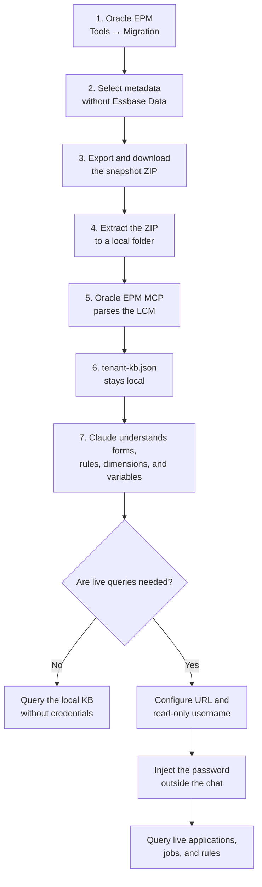

# Install Oracle EPM MCP in Claude

This guide shows the shortest path to use the MCP with Claude and understand an
Oracle EPM environment without transferring Essbase data.

## End-to-end workflow



## What works today

| Product | Status |
| --- | --- |
| Claude Code | Works now through the local `stdio` MCP |
| Claude Desktop | Requires this repository to be packaged as a `.dxt` file |
| Claude web | Requires the planned remote HTTPS MCP with OAuth |
| ChatGPT | Requires the planned remote HTTPS MCP with OAuth |

## Option A — Claude Code

### 1. Requirements

- Git
- Node.js 20 or later
- Claude Code

### 2. Download and install

In PowerShell:

```powershell
cd C:\apps
git clone https://github.com/brunohernangallo/epm-planning-mcp.git
cd oracle-epm-mcp
npm.cmd install
npm.cmd run check
npm.cmd test
```

### 3. Register the MCP in Claude Code

Start in KB-only mode, without Oracle credentials:

```powershell
claude mcp add --scope user oracle-epm `
  --env ORACLE_EPM_KB_PATH=C:/secure/client/tenant-kb.json `
  -- node C:/apps/oracle-epm-mcp/src/index.js
```

Verify the installation:

```powershell
claude mcp get oracle-epm
claude mcp list
```

You can also run `/mcp` inside Claude Code to review the connection status.

Do not include `ORACLE_EPM_PASSWORD` in this command. It could remain in shell
history or persistent configuration.

## Option B — Claude Desktop

Claude Desktop installs local MCP servers through **Desktop Extensions**. The
installable artifact for this project will be `oracle-epm-mcp.dxt`.

Once the `.dxt` package is published, the user will:

1. Open Claude Desktop.
2. Go to **Settings → Extensions**.
3. Open **Advanced settings**.
4. Select **Install Extension…**.
5. Choose `oracle-epm-mcp.dxt`.
6. Configure the local KB path and non-sensitive settings.
7. Restart Claude Desktop if the tools do not appear.

The `.dxt` package is not included in version `0.1.0` yet. The remaining work is
to add `manifest.json`, mark the password as sensitive, and run `dxt pack`.
Claude Desktop encrypts fields marked as sensitive with the operating system
credential store.

Official reference:
[Anthropic — Local MCP servers and Desktop Extensions](https://support.anthropic.com/en/articles/10949351-getting-started-with-local-mcp-servers-on-claude-desktop).

## Create and download the snapshot

The user needs Service Administrator access or equivalent Migration
permissions.

### Create a new selective export

1. Sign in to the Oracle EPM environment.
2. Open **Tools → Migration**.
3. Open the **Categories** tab.
4. Select the required structural artifacts:
   - Planning applications and cubes
   - dimensions and members
   - forms
   - Calculation Manager rules and rulesets
   - substitution variables and Smart Lists
   - dashboards, reports, jobs, and navigation flows
   - Data Management/FDMEE
   - security only when access analysis is required
5. Under Planning, leave **Essbase Data / Planning Data unselected**.
6. Select **Export**.
7. Enter a recognizable name, such as `Client_Metadata_2026-07-26`.
8. Review the Migration Status Report until the export completes successfully.
9. Open the **Snapshots** tab.
10. Select the snapshot and download the ZIP file.

Oracle documents how Migration can select artifact categories, export them, and
make the result available from the Snapshots tab:
[Oracle — Exporting Artifacts](https://docs.oracle.com/en/cloud/saas/tax-reporting-cloud/agtrc/admin_migrations_100x829e1e1a.html).

### Use an existing Artifact Snapshot

You may download an existing Artifact Snapshot from **Snapshots**, but inspect
its contents first. Some automatic snapshots include application data. A new
selective export without Essbase Data is preferred for this onboarding flow.

Do not use **Environment Backup**. It is a complete physical backup intended for
restore or cloning and contains all artifacts and data.

## Parse the snapshot locally

The current parser accepts an extracted folder, not the ZIP file itself.

```powershell
Expand-Archive `
  -LiteralPath C:\Downloads\Client_Metadata_2026-07-26.zip `
  -DestinationPath C:\secure\client\lcm

node C:\apps\oracle-epm-mcp\src\lcm-cli.js `
  C:\secure\client\lcm `
  C:\secure\client\tenant-kb.json
```

Then configure:

```text
ORACLE_EPM_KB_PATH=C:/secure/client/tenant-kb.json
```

Keep the ZIP and `tenant-kb.json` local and outside Git.

## What to ask Claude

After registering the MCP and creating the KB:

```text
Use Oracle EPM MCP to summarize the environment in my tenant-kb.json.
Start with applications, cubes, dimensions, forms, rules, and variables.
Do not query the live environment yet.
```

Example questions:

```text
Find every form related to Revenue and explain which cube each form uses.
```

```text
Explain the Calculate Forecast rule in business terms before showing the
technical details.
```

```text
Which substitution variables define the current period and scenario?
```

```text
Compare the dimensions used by the Cash Flow forms.
```

Claude will automatically select tools such as `epm_kb_summary`,
`epm_search_artifacts`, and `epm_get_artifact`.

## Enable live queries

Do not give the URLs to Claude in the chat. Configure them outside the
conversation:

```text
ORACLE_EPM_BASE_URL=https://example.epm...oraclecloud.com
ORACLE_EPM_APPLICATION=NetSuite
ORACLE_EPM_CUBE=Plan
ORACLE_EPM_USERNAME=read-only-user
```

Inject the password into the MCP process through Windows Credential Manager,
Keychain, a vault, or a local launcher:

```text
ORACLE_EPM_PASSWORD=<secret injected at startup>
```

Never paste the password into Claude or ChatGPT.

You can then ask:

```text
Use Oracle EPM MCP to validate the read-only connection, list the applications,
and compare the live rules with the rules found in the local KB.
Do not perform any mutation.
```

The MCP will call `epm_list_applications`, `epm_list_rules`, and
`epm_list_jobs`.

## What about ChatGPT?

The snapshot and KB workflow is the same, but ChatGPT cannot run the current
local `stdio` MCP. A remote variant must first be published with:

- MCP Streamable HTTP
- a stable HTTPS URL
- OAuth
- tenant isolation
- a secret manager for Oracle credentials

Once it exists, the user will add that URL as an MCP app in ChatGPT. Oracle
credentials must not be pasted into the conversation.

## Client handoff summary

```text
1. Export a snapshot from Tools → Migration.
2. Include all required metadata and exclude Essbase Data / Planning Data.
3. Download the ZIP and keep it locally.
4. The MCP converts it into a local knowledge base.
5. Claude can analyze that KB without Oracle credentials.
6. For live queries, configure the URL and a read-only account outside the chat.
7. Never share the password with Claude or store it in Git.
```
