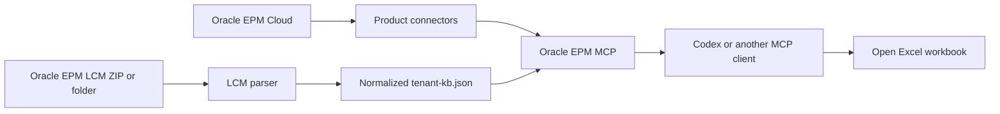
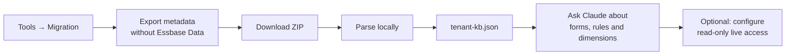

# EPM Planning MCP

Explore your Oracle EPM Planning environment and read/write live data — from Claude.

## Install

Paste this into **Claude Code** and follow the step-by-step wizard:

```bash
git clone https://github.com/BryantParkConsulting/oracle-toolkit.git
cd oracle-toolkit/packages/mcp-planning
npm install
npm run setup
```

That's it. `npm run setup` asks one thing at a time — your pod URL, username, a
local password, and (optionally) downloads a small snapshot so Claude understands
your whole environment — then prints the line to register the server and a few
prompts to try. On Windows use `npm.cmd` instead of `npm`.

## What you can do with it

Once installed, you just talk to Claude in plain language. **Ask anything about your
environment and it answers** — from the parsed snapshot it knows your forms, rules,
dimensions, members, variables and how they connect, so questions like *"how is
compensation calculated here?"*, *"which rule feeds the P&L?"* or *"what does this
form load?"* get a real answer, no digging through the UI.

| You can… | Example prompt |
| --- | --- |
| **Ask anything about the environment** | *"How is the workforce compensation model built? Which rules run it?"* |
| **Understand the structure** | *"What forms and business rules does this application have? Which dimensions and members?"* |
| **Query live data** | *"Show me the FY25 income statement — Income, Gross Profit, Net Income."* |
| **Slice any number** | *"Total salary by department for FY26 Forecast."* |
| **Upload data** | *"Load this salary spreadsheet into the Workforce cube."* |
| **Run calculations** | *"Run the aggregation rule and show me the new totals."* |
| **Validate a load** | *"Read back the total I just loaded and check it ties to my file."* |

Under the hood these map to a small set of tools — `epm_search_artifacts`,
`epm_read_cell`, `epm_load_data`, `epm_run_rule` (full list below).

> **Scope.** This server is for **using** a Planning application: explore, query,
> load, calculate. **Creating new objects** (forms, calc rules) is intentionally out
> of scope — that is a separate, EPM-Automate-based tool.

<details>
<summary>What the wizard sets up, and why</summary>

- A **local** password file (masked prompt — never in the chat or a command argument).
- An **artifact-only** snapshot parsed into a compact `tenant-kb.json`: Claude reads
  this small file (forms, rules, dimensions) to understand the whole environment
  **without** pulling Essbase data — far cheaper on tokens. Live data still reads over
  REST on demand. This one step needs EPM Automate installed (see Prerequisites); the
  rest works with just Node.
- The exact `claude mcp add` command to register the server, KB-only or with live access.

</details>

---

An open-source Model Context Protocol server for Oracle EPM Cloud. The first
connector targets Planning/NSPB and combines offline LCM exploration with live
Planning REST calls. The architecture leaves room for Account Reconciliation
and Close Management and Consolidation connectors.

> Early MVP. Use a non-production environment and read-only credentials while
> evaluating it.

## Architecture



The MCP server is responsible for Oracle EPM data and operations. Excel remains
an optional output surface controlled by the user's connected Excel session.
This separation keeps the server reusable outside Excel.

## From snapshot to your first question



For a copy/paste Claude installation guide, the exact snapshot steps, and
example prompts, see [`CLAUDE-QUICKSTART.md`](CLAUDE-QUICKSTART.md).

## Current tools

| Tool | Purpose | Default |
| --- | --- | --- |
| `epm_parse_lcm` | Parse an extracted LCM folder into normalized JSON | Read-only |
| `epm_kb_summary` | Summarize a local `tenant-kb.json` | Read-only |
| `epm_search_artifacts` | Search forms, rules, variables, reports and dashboards | Read-only |
| `epm_get_artifact` | Retrieve one exact LCM artifact | Read-only |
| `epm_list_applications` | List live Planning applications | Read-only |
| `epm_list_jobs` | List recent Planning jobs | Read-only |
| `epm_list_rules` | List Planning business rules | Read-only |
| `epm_read_cell` | Read one cell back from a cube (`exportdataslice`) | Read-only |
| `epm_run_rule` | Run a Planning rule | Disabled |
| `epm_load_data` | Write cells into a cube (`importdataslice`, **no Import Data job required**) | Disabled |

Snapshot restore is intentionally out of scope.

## Command-line tools (`cli/`)

For terminal use without an MCP client. These read the password from a file
(`~/.epm/<client>.pass`) or `EPM_PASS`, never from an argument.

| Script | Purpose |
| --- | --- |
| `cli/epm-run.js` | epmautomate wrapper — login/export/import/`runrule` via a `.epw`, multi-client from `~/.epm/clients.json`. Mutating verbs need `--yes`. |
| `cli/epm-load-cli.js` | Load a staging grid (`.xlsx`) into a cube over `importdataslice`. `--test` sends the first two rows first. |
| `cli/epm-auth-probe.js` | Diagnose a `401` — tries the common OCI Basic-Auth username formats and reports which returns `200`. |

The data plane (`epm_load_data` / `epm_read_cell` / `cli/epm-load-cli.js`) was
proven against a production OCI Planning pod in 2026-07: it loaded a full 464-row
workforce roster with no predefined Import Data job.

**What the toolkit now knows so you don't rediscover it:**

- **`epm_load_data` uses the correct `dataGrid` wire shape** (a `slices` body returns
  HTTP 400). POV is a flat member array, Period first — see the header note in
  `src/planning-client.js`.
- **`epm_run_rule` warns before running a grid-bound Groovy rule** (ActiveStatus,
  Synchronize, Process-Loaded-Data…). Those need a Planning form and can't run headless;
  the guard is overridable with `acknowledgeGridRule: true`.
- **The full playbook** — load/calc/validate order, runtime prompts, the
  `Undefined_Class` intersection trap, TP-period naming, and the 401 username fix — is in
  [`docs/WORKFORCE-LOAD-RECIPE.md`](docs/WORKFORCE-LOAD-RECIPE.md) and
  [`docs/EPM-DATA-RUNBOOK.md`](docs/EPM-DATA-RUNBOOK.md).

## How NSPB itself works — [`docs/NSPB-KB.md`](docs/NSPB-KB.md)

The two files above cover *this toolkit*. [`docs/NSPB-KB.md`](docs/NSPB-KB.md) covers **the
product**: the modules (Sales & COGS, OpEx, Workforce), clusters/cards/tabs/forms,
dimensionality, Smart View and ad-hoc analysis, metadata management, the integration and job
console, security and provisioning, and the business-rule sequence each module expects.

**Read it before inferring how a module behaves from a client's LCM export.** An export tells
you which rules a tenant happens to have; it does not tell you which sequence is correct, and
the two diverge in practice. A tenant carrying an `AggAll` and an `ADMIN - Aggregate WF Expenses`
looks like the aggregation is covered — but the documented Workforce sequence is
`ActiveStatus` → `CopyToPlan` → `CalcComp`, then `Agg_Select` on Plan, and neither of those
tenant rules moves data between cubes. Substituting them leaves the P&L empty and raises no
error.

Client-identifying references are replaced with neutral placeholders; the product knowledge is
unchanged.

## Prerequisites — what needs what

The toolkit has **two engines**, and only one of them needs an external install:

| Engine | What runs on it | Needs EPM Automate installed? |
| --- | --- | --- |
| **REST** (`fetch`) | The whole MCP server (`epm_list_*`, `epm_read_cell`, `epm_load_data`, `epm_run_rule`), plus `cli/epm-load-cli.js` and `cli/epm-auth-probe.js` | **No** — just Node 18+ and credentials |
| **EPM Automate CLI** | `cli/epm-run.js` — `exportmetadata`, snapshot download/upload, `importsnapshot`, and `runrule` via a `.epw` | **Yes** |

So: **loading data, reading cells, and running business rules work over pure REST — no EPM
Automate required.** You only need Oracle's EPM Automate CLI for the snapshot/metadata
operations in `cli/epm-run.js` (they have no REST equivalent). Install it from your pod's
**Downloads** page (it lands at `C:\Program Files\Oracle\EPM Automate` on Windows); override
the path with the `EPM_AUTOMATE` env var if it's elsewhere.

## Install

```bash
npm install
npm run check
npm test
```

Create a local profile from `examples/profile.example.json`. Do not put a
password in a committed profile. Set `ORACLE_EPM_PROFILE` to that local file
and inject `ORACLE_EPM_PASSWORD` into the MCP process through an OS credential
launcher.

For unattended deployments, use the operating system credential store and a
small launcher that injects the secret only into the MCP process.

## Codex configuration

Add a local stdio server to your Codex MCP configuration:

```toml
[mcp_servers.oracle_epm]
command = "node"
args = ["C:/apps/oracle-epm-mcp/src/index.js"]

[mcp_servers.oracle_epm.env]
ORACLE_EPM_PROFILE = "C:/secure/oracle-epm-profile.json"
ORACLE_EPM_KB_PATH = "C:/secure/client/tenant-kb.json"
```

Restart Codex after changing MCP configuration.

Do not place `ORACLE_EPM_PASSWORD` in a shared or committed configuration.

## LCM conversion

Extract an Oracle Migration snapshot, then run:

```bash
node src/lcm-cli.js C:/path/to/extracted-lcm C:/secure/tenant-kb.json
```

LCM snapshots can contain client metadata, security information and usernames.
Keep the generated JSON local and gitignored. Public examples must be synthetic
or anonymized.

For the recommended export scope, credential sequence, local/remote distribution
options, and the Claude/ChatGPT publishing plan, see
[`MCP-PUBLISHING.md`](MCP-PUBLISHING.md).

## Security model

- Oracle EPM uses HTTP Basic Authentication for the current Planning connector.
- Credentials are never accepted as tool arguments.
- Mutating tools are disabled unless `ORACLE_EPM_ENABLE_MUTATIONS=true`.
- `epm_run_rule` additionally requires `confirm=true`.
- Restore-snapshot functionality will not be implemented.
- Client LCMs, normalized KBs, exports and profiles are ignored by Git.

## Roadmap

- Complete schema-compatible migration of the production LCM parser.
- Smart View XML form and ad-hoc grid reads.
- Data Integration/FDMEE inventory and job tools.
- Account Reconciliation connector.
- Close Management and Consolidation connector.
- Excel comparison helpers that return typed, worksheet-ready tables.

## License

MIT. Oracle, NetSuite, Essbase and related marks belong to their respective
owners. This project is independent and is not endorsed by Oracle.
